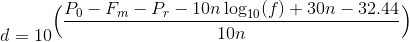

## Wifi Indoor Positioning

### Purpose

To get a model which can be used to evaluate the position of a device indoor.

### Data

`rssi_data.zip` file contains 9 log files, each of them was generated from different location in office 615(received wifi frames from 5 devices by multiple wifi probes), the coordinates of these location points can be get from the file names:

	X_Axis-Y_Axis.log

For example, `14.5-3.5.log` will give us `(14.5, 3.5)`.

The blueprint with coordinate system is here:

The locations of these wifi probes are:

	{
		"e4956e410ac2": (8.5, 5.7), "e4956e4e540a": (12.0, 9.0), 
		"e4956e410abd": (17.5, 5.5),"e4956e410b4c": (20.5, 7.2), 
		"e4956e410b32": (23.5, 5.2),"e4956e410ac0": (26.8, 8.0), 
		"e4956e4e53e4": (26.8, 5.5), "e4956e410acf": (35.5, 5.5), 
		"e4956e4e53e7": (38.2, 7.4)
	}

#### Data structure

	Timestamp,Probe' s Mac,SourceMac,DestinationMac,BSSID,FrameType,RSSI,Channel,SSID

For example:

	1499425657682477,e4956e410ac2,ac:37:43:52:d4:dc,
	ac:37:43:52:d4:dc,00:00:00:00:00:00,CTS,-52,0,

#### RSSI to Distance

LaTex:

	d=10^{\Big(\dfrac{P_0-F_m-P_r-10n \log_{10}(f) + 30n - 32.44}{10n}\Big)}
	

Where

- Fm=Fade Margin
- N=Path-Loss Exponent
- Po=Signal power (dBm) at zero distance
- Pr=Signal power (dBm) at distance
- F=signal frequency in MHz

For details, please refer to [Outdoor Localization System Using RSSI Measurement of Wireless Sensor Network.pdf](https://github.com/chawlamit/WSN_Localization_Mapping/blob/master/docs/A0359112112.pdf)

### Triangulation

Since we have the signal strength indexes which can be transformed to disctance from a specific device to more than 3 wifi probes, and the location of these wifi probes are known by us, we can apply triangulation algorithm to evaluation and determine the position of this device.

### Validation

we have the data from these 5 devices plus another device also from 10 locations, including 9 locations describered above, they will be used to validate the quality of the model.

#### =======================================================

## More background: Wifi probe research

What we mean by `Wifi probe` is to detect the global MAC addresses of wifi devices passively, which depends on the frames sending out from the wifi devices. usually, the status of Wifi devices are in unauthenticated and unassoiciated stage, which indicates that these devices are not connected to any access points. therefore, we will focus on how to detect devices in this stage.

This article will discuss below topics:

- 802.11 backgroud
- MAC Address Block from IEEE
- Reality challenges

### 802.11 background

There are 3 stages from authentication and association perspective for a Wifi enabled device in a wireless network:

1. Initial state; not authenticated and not associated
2. Authenticated but not yet associated
3. Authenticated and associated

From [Frame Transmission and Association and Authentication States](https://www.safaribooksonline.com/library/view/80211-wireless-networks/0596100523/ch04.html#wireless802dot112-CHP-4-SECT-4) in book [802.11 Wireless Networks: The Definitive Guide, 2nd Edition](https://www.safaribooksonline.com/library/view/80211-wireless-networks/0596100523/), we can get belwo graph:

Different frames are accepeted by each stage, we can tell from the above demostration that there are 3 classes of frames:

- class 1 frames are accepted by all 3 stages.
- class 2 frames are only accepted by stage 2 and 3
- class 3 frames are only accepted by stage 3

Below table listed all frames belong to class 1:

|Control                |Management                      | Data                                   | 
|:----------------------|:-------------------------------|:---------------------------------------|
|Request to Send (RTS)  |Probe Request                   |Any frame with ToDS and FromDS false (0)|
|Clear to Send (CTS)    |Probe Response                  |                                        |
|Acknowledgment (ACK)   |Beacon                          |                                        |
|CF-End                 |Authentication                  |                                        |
|CF-End+CF-Ack          |Deauthentication                |                                        |
|                       |Announcement Traffic Indication Message (ATIM)  |                        |

Frames belong to class 2:

|Control                |Management                      | Data                                   | 
|:----------------------|:-------------------------------|:---------------------------------------|
|None                   |Association Request/Response    |None                                    |
|                       |Reassociation Request/Response  |                                        |
|                       |Disassociation                  |                                        |

Frames belong to class 3:

|Control                |Management                      | Data                                   | 
|:----------------------|:-------------------------------|:---------------------------------------|
|PS-Poll                |Deauthentication    |Any frames, including ToDS or FromDS bits set       |

For all available frames in 802.11, we can refer to [this article](https://supportforums.cisco.com/document/52391/80211-frames-starter-guide-learn-wireless-sniffer-traces) for a summarized breifing.

So, even in unauthentication and unassoiciation stage, Wifi devices are able to send or respond to quite a few frames, which seems to be good news for what we are trying to accomplish, but considering privacy and power saving strategy, device manufacturer usually apply lots of optimization when the devices are in stage 1, like MAC address randomizaton, lower the frequency of sending probe request when the devices are not in active reaction with users.
